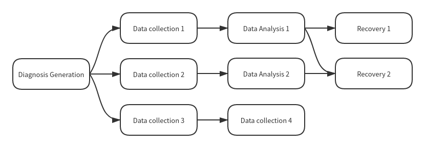

# 基于图的诊断流水线

本文阐述了 Kube Diagnoser 的诊断流水线设计。

## 背景

Kube Diagnoser 早期设计上为了规范和简化流水线的定义，将诊断流程基于链表的设计分成了三个阶段：信息采集、故障诊断、故障恢复。用户可以在每个阶段定义需要处理的操作并对问题进行诊断。在很多情况下，不同问题导致的现象可能是相同的，或着某个现象是多个故障连锁反应导致的。例如导致节点状态由 `Ready` 变为 `NotReady` 的因素非常多，分析时需要需要在多个排查路径上逐个分析来寻找根本原因。基于链表的设计虽然降低了管理复杂性，但是无法适应更加多样化的诊断场景。图数据结构对该场景明显具备更准确的抽象能力。

## 设计假设

基于图的诊断流水线在设计上需要考虑以下假设条件：

* 有限可终止：整个流水线不是无限执行的，在一定时间和空间复杂度内能够终止运行。
* 过程可追溯：诊断结束后可以查看运行过程中某个节点产生的结果。
* 状态机可扩展：支持增加新的处理节点到流水线中。

## 实现

通过引入下列 API 对象可以实现基于图的诊断流水线：

* `Operation`：描述如何在诊断流水线中加入处理节点以及如何存储该处理节点产生的结果。
* `OperationSet`：表示诊断过程状态机的有向无环图。
* `Trigger`：描述如何通过 Prometheus 报警或 Event 触发一次诊断。

### Operation

`Operation` API 对象的数据结构如下：

```go
// OperationSpec 定义了 Operation 的目标状态。
type OperationSpec struct {
    // Processor 描述了如何在 Kube Diagnoser 中注册一个操作处理器。
    Processor Processor `json:"processor"`
    // Dependences 是所有被依赖且必须预先执行的诊断操作列表。
    Dependences []string `json:"dependences,omitempty"`
    // Storage 表示操作处理结果的存储类型。
    // 如果该字段为空，那么操作处理结果不会被保存。
    Storage *Storage `json:"storage,omitempty"`
}

// Processor 描述了如何在 Kube Diagnoser 中注册一个操作处理器。
type Processor struct {
    // ExternalIP 是操作处理器的监听 IP。
    // 如果该字段为空，那么默认为 Kube Diagnoser Agent 的地址。
    ExternalIP *string `json:"externalIP,omitempty"`
    // ExternalPort 是操作处理器的服务端口。
    // 如果该字段为空，那么默认为 Kube Diagnoser Agent 的服务端口。
    ExternalPort *int32 `json:"externalPort,omitempty"`
    // Path 是操作处理器服务的 HTTP 路径。
    Path *string `json:"path,omitempty"`
    // Scheme 是操作处理器服务的协议。
    Scheme *string `json:"scheme,omitempty"`
    // 操作处理器超时的秒数。
    // 默认为 30 秒。最小值为 1。
    TimeoutSeconds *int32 `json:"timeoutSeconds,omitempty"`
}

// Storage 表示操作结果的存储类型。
type Storage struct {
    // HostPath 表示宿主机上的目录。
    HostPath *HostPath `json:"hostPath,omitempty"`
}

// HostPath 表示宿主机上的目录。
type HostPath struct {
    // 宿主机上目录的路径。
    // 如果该字段为空，那么默认为 Kube Diagnoser Agent 的数据根目录。
    Path string `json:"path"`
}

// Operation 的 API 对象。
type Operation struct {
    metav1.TypeMeta   `json:",inline"`
    metav1.ObjectMeta `json:"metadata,omitempty"`

    Spec OperationSpec `json:"spec,omitempty"`
}
```

### OperationSet

`OperationSet` API 对象的数据结构如下：

```go
// OperationSetSpec 定义了 OperationSet 的目标状态。
type OperationSetSpec struct {
    // Edges 包含有向无环图中所有表示诊断操作路径的边。
    Edges []Edge `json:"edges"`
}

// Edge 是有向无环图中的一个边。
// 如果 From 为空，那么他表示诊断操作路径中的第一个操作。
type Edge struct {
    // From 是一条边上的源顶点。
    // 如果 From 为空，那么他表示诊断的开始。
    From *Node `json:"from,omitempty"`
    // To 是一条边上的目标顶点。
    To Node `json:"to"`
}

// Node 是有向无环图中的一个顶点。它包含序号和操作名。
type Node struct {
    // ID 是该顶点的唯一标识符。
    ID int `json:"id"`
    // Operation 是在该顶点运行的操作名。
    Operation string `json:"operation"`
}

// OperationSetStatus 定义了 OperationSet 的实际状态。
type OperationSetStatus struct {
    // TopologicalSorts 是有向无环图所有拓扑排序的集合。
    TopologicalSorts []TopologicalSort `json:"topologicalSorts"`
    // 表示定义中提供的边是否能生成合法的有向无环图。
    Ready bool `json:"ready"`
}

// TopologicalSort 表示与所有边方向一致的顶点线性顺序。
type TopologicalSort []Node

// OperationSet 的 API 对象。
type OperationSet struct {
    metav1.TypeMeta   `json:",inline"`
    metav1.ObjectMeta `json:"metadata,omitempty"`

    Spec OperationSetSpec `json:"spec,omitempty"`
    Status OperationSetStatus `json:"status,omitempty"`
}
```

### Trigger

`Trigger` API 对象的数据结构如下：

```go
// TriggerSpec 定义了 Trigger 的目标状态。
type TriggerSpec struct {
    // OperationSet 是生成 Diagnosis 中引用的 OperationSet 名。
    OperationSet string `json:"operationSet"`
    // SourceTemplate 是用于生成 Diagnosis 的模板源。
    SourceTemplate SourceTemplate `json:"sourceTemplate"`
}

// SourceTemplate 描述用于生成 Diagnosis 的信息。
type SourceTemplate struct {
    // 下列源中必须指定一个唯一的模板源。
    // PrometheusAlertTemplate 声明基于 Prometheus 报警创建 Diagnosis 的模板。
    PrometheusAlertTemplate *PrometheusAlertTemplate `json:"prometheusAlertTemplate,omitempty"`
    // KubernetesEventTemplate 声明基于 Event 创建 Diagnosis 的模板。
    KubernetesEventTemplate *KubernetesEventTemplate `json:"kubernetesEventTemplate,omitempty"`
}

// PrometheusAlertTemplate 声明基于 Prometheus 报警创建 Diagnosis 的模板。
type PrometheusAlertTemplate struct {
    // Regexp 是用于匹配 Prometheus 报警模板的正则表达式。
    Regexp PrometheusAlertTemplateRegexp `json:"regexp"`
    // NodeNameReferenceLabel 指定用于设置 Diagnosis 的 NodeName 字段的标签。
    NodeNameReferenceLabel model.LabelName `json:"nodeNameReferenceLabel"`
}

// PrometheusAlertTemplateRegexp 是用于匹配 Prometheus 报警模板的正则表达式。
// 所有的正则表达式必须遵循 RE2 规范，详情可参考 https://golang.org/s/re2syntax。
type PrometheusAlertTemplateRegexp struct {
    // AlertName 是用于匹配 Prometheus 报警的 AlertName 字段的正则表达式。
    AlertName string `json:"alertName,omitempty"`
    // Labels 是用于匹配 Prometheus 报警的 Labels 字段的正则表达式。
    // 只有标签的值为正则表达式并且所有标签均与 Prometheus 报警一致时才可以成功匹配。
    Labels model.LabelSet `json:"labels,omitempty"`
    // Annotations 是用于匹配 Prometheus 报警的 Annotations 字段的正则表达式。
    // 只有注解的值为正则表达式并且所有注解均与 Prometheus 报警一致时才可以成功匹配。
    Annotations model.LabelSet `json:"annotations,omitempty"`
    // StartsAt 是用于匹配 Prometheus 报警的 StartsAt 字段的正则表达式。
    StartsAt string `json:"startsAt,omitempty"`
    // EndsAt 是用于匹配 Prometheus 报警的 EndsAt 字段的正则表达式。
    EndsAt string `json:"endsAt,omitempty"`
    // GeneratorURL 是用于匹配 Prometheus 报警的 GeneratorURL 字段的正则表达式。
    GeneratorURL string `json:"generatorURL,omitempty"`
}

// KubernetesEventTemplate 声明基于 Event 创建 Diagnosis 的模板。
type KubernetesEventTemplate struct {
    // Regexp 是用于匹配 Event 模板的正则表达式。
    Regexp KubernetesEventTemplateRegexp `json:"regexp"`
}

// KubernetesEventTemplateRegexp 是用于匹配 Event 模板的正则表达式。
// 所有的正则表达式必须遵循 RE2 规范，详情可参考 https://golang.org/s/re2syntax。
type KubernetesEventTemplateRegexp struct {
    // Name 是用于匹配 Event 的 Name 字段的正则表达式。
    Name string `json:"name,omitempty"`
    // Namespace 是用于匹配 Event 的 Namespace 字段的正则表达式。
    Namespace string `json:"namespace,omitempty"`
    // Reason 是用于匹配 Event 的 Reason 字段的正则表达式。
    Reason string `json:"reason,omitempty"`
    // Message 是用于匹配 Event 的 Message 字段的正则表达式。
    Message string `json:"message,omitempty"`
    // From 是用于匹配 Event 的 From 字段的正则表达式。
    // 所有 From 中的字段均为正则表达式。
    From corev1.EventSource `json:"source,omitempty"`
    // Type 是用于匹配 Event 的 Type 字段的正则表达式。
    Type string `json:"type,omitempty"`
}

// TriggerStatus 定义了 Trigger 的实际状态。
type TriggerStatus struct {
    // 表示 Trigger 是否已被成功更新至被引用 OperationSet 的 OwnerReferences 列表。
    Ready bool `json:"ready"`
}

// Trigger 的 API 对象。
type Trigger struct {
    metav1.TypeMeta   `json:",inline"`
    metav1.ObjectMeta `json:"metadata,omitempty"`

    Spec TriggerSpec `json:"spec,omitempty"`
    Status TriggerStatus `json:"status,omitempty"`
}
```

### 注册诊断操作

诊断操作表示在诊断流水线中运行的某个逻辑，是对诊断流水线管理的最小单元，例如获取节点信息、对日志中的关键字进行匹配、对进程进行性能剖析等。通过创建 Operation 对象可以注册诊断操作。诊断操作的后端是一个 HTTP 服务器。注册诊断操作时需要指定 HTTP 服务器监听的地址、路径、诊断结果的存储类型等。

### 注册诊断流水线

诊断流水线是多个诊断操作的集合，通常一次诊断可能有多个排查路径，所以一次诊断的状态机通过有向无环图进行抽象。通过创建 OperationSet 对象可以定义表示诊断状态机的有向无环图。诊断开始的状态为有向无环图的起点，有向无环图中的路径均为诊断过程中的排查路径，当某条路径可以成功运行到终点时则表示诊断运行成功。诊断流水线的生成逻辑如下：

1. 用户创建 OperationSet 资源并定义有向无环图中所有的边。
1. 根据 OperationSet 的定义构建有向无环图。
1. 如果无法构建合法的有向无环图，则将注册失败的状态和失败原因更新到 OperationSet 中。
1. 枚举 OperationSet 中所有的拓扑排序路径并更新到 OperationSet 中。

### 触发诊断

Diagnosis 对象的元数据中包含了需要执行的 OperationSet。触发诊断包括手动和自动两种方式。通过手动创建 Diagnosis 对象可以直接触发诊断。通过创建 Trigger 对象并配置 Prometheus 报警模板或 Event 模板可以基于 Prometheus 或 Event 自动生成 Diagnosis 以触发诊断流水线。

### 运行诊断流水线

Diagnosis 对象的元数据中记录了诊断流水线的运行状态。诊断流水线的运行逻辑如下：

1. 获取被 Diagnosis 引用的 OperationSet 中所有的拓扑排序路径。
1. 按照拓扑排序执行路径中 Operation 定义的诊断操作，将 Operation 运行的结果更新到 Diagnosis 中并持久化到 Operation 中相应的存储类型。
1. 如果路径中定义的某个诊断操作执行失败，则执行下一条拓扑排序路径。
1. 如果路径中定义的所有诊断操作均执行成功，则该次诊断成功。
1. 如果所有路径均无法成功，则该次诊断失败。



上列为一个表示诊断流水线的有向无环图，该图的拓扑排序路径表示多个可执行的排查路径：

* Diagnosis 生成、数据收集 1、数据分析 1、恢复 1
* Diagnosis 生成、数据收集 1、数据分析 1、恢复 2
* Diagnosis 生成、数据收集 2、数据分析 2、恢复 2
* Diagnosis 生成、数据收集 3、数据收集 4

### 附属关系

通过设置对象的 OwnerReferences 列表可以表示上列对象之间的附属关系：

* Diagnosis 可以由 Trigger 自动创建。Diagnosis 创建后被更新至 Trigger 的 OwnerReferences 列表。
* Trigger 通过引用 OperationSet 来定义被自动创建的 Diagnosis。Trigger 创建后被更新至 OperationSet 的 OwnerReferences 列表。
* OperationSet 通过引用 Operation 来定义每个顶点上需要执行的诊断操作。OperationSet 创建后被更新至 Operation 的 OwnerReferences 列表。
